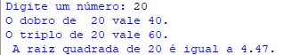

<h1 align="center">
   Double Triple Square Root

</h1>

<h2 align="center">
System for calculating double, triple and the square root of a number
</h2>

<h3 align="center"> created with Python </h3>

## Screens

    
 

---

<h4 align="center"> <em>&lt;/&gt;</em> by Developer Mattos</h4>
